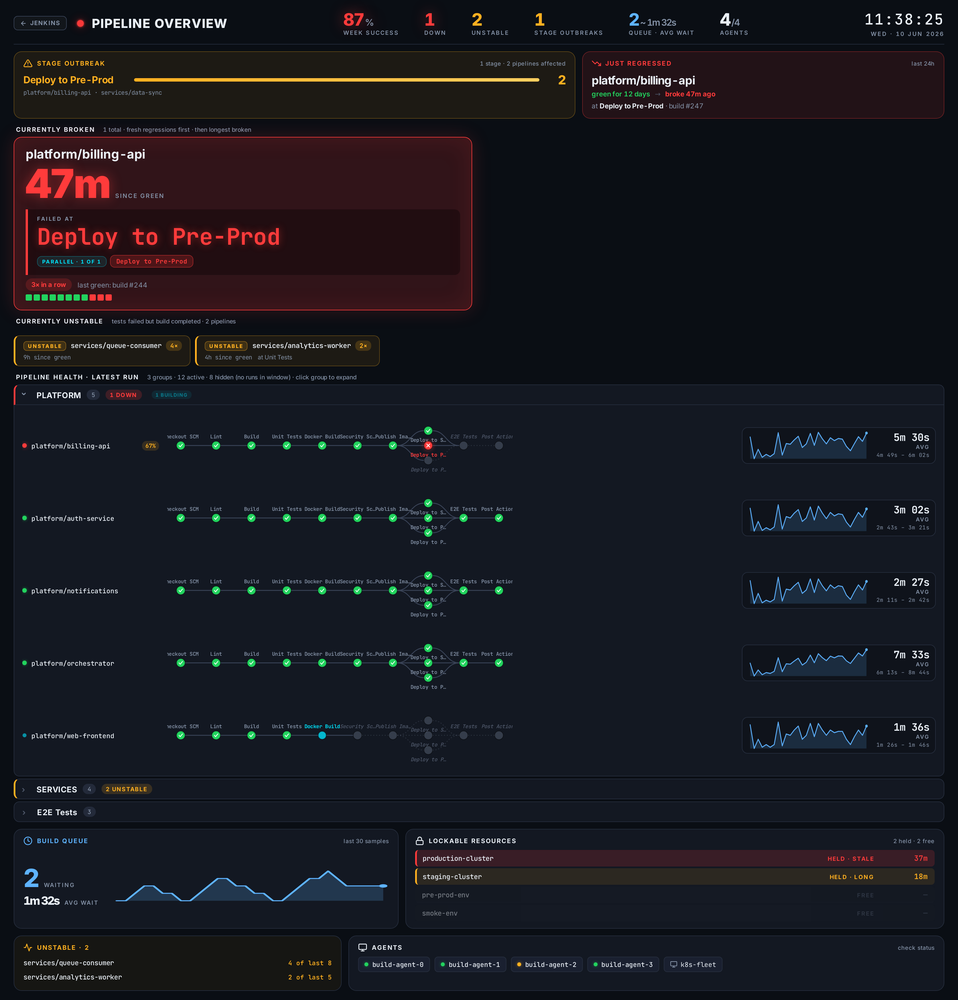
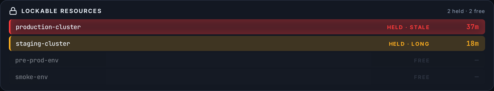
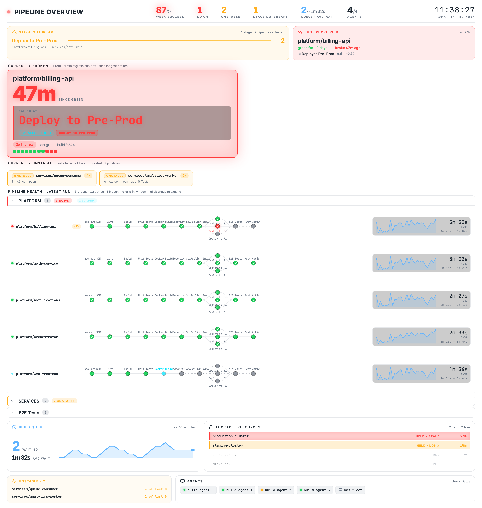

# Holistic

Jenkins dashboard for a TV in the office. shows what's broken, where, and for how long. designed to be read from across the room.



## what it does

top strip is the at-a-glance state of your CI: weekly success rate, how many pipelines are currently down, how many are unstable, how many stage outbreaks are happening, build queue + avg wait, agents healthy / total.

below that:

* **stage outbreak** clusters broken pipelines by which stage they failed at. when 5 pipelines all break at "Deploy" or "E2E Tests" it's almost always a shared library or shared infra problem and you want to know fast.
* **just regressed** flags pipelines that were green for at least 6h then broke in the last 24h. the scariest class of failure because something just changed.
* **currently broken** shows pipelines whose latest build failed. fresh regressions (broke in the last 24h after >= 6h green) get the top cards so today's actionable failures don't get buried; the rest follow, longest-broken first.
* **currently unstable** is its own smaller section, separate from broken, since "tests failed but build completed" is a different problem from "the build itself blew up".
* **pipeline health** expands per group, each pipeline rendered like jenkins' native stage view but smaller, with curved bezier connectors. parallel branches fan out vertically, each branch keeping its own inner stage sequence.
* **exec time graph** per pipeline shows the last 30 *successful* build durations as a sparkline + avg + range. trend chip lights up amber if builds are getting consistently slower (↑ %) or green if faster (↓ %).
* **build queue** with a 60-sample sparkline. sustained queue depth is your signal to add agents.
* **lockable resources** pulses amber after 15min held, red after 30min. catches stuck CI environments before someone notices manually.
* **agents** panel at the bottom (k3s + ec2 fleet style).

the lockable resources panel only shows when the [lockable-resources](https://plugins.jenkins.io/lockable-resources/) plugin is installed, and it sorts the most-stuck locks to the top so a resource held far too long is the first thing you see:



## install

Manage Jenkins → Plugins → Available plugins, search **Holistic**, install, and restart. With JCasC or a plugins list, add `holistic`.

Offline / air-gapped: grab `holistic.hpi` from a [release](https://github.com/jenkinsci/holistic-plugin/releases) (or `mvn package` it yourself) and drop it in `$JENKINS_HOME/plugins/`, or bake it into a docker image:
```dockerfile
COPY holistic.hpi /usr/share/jenkins/ref/plugins/
```
with `PLUGINS_FORCE_UPGRADE=true` so a newer bundled HPI replaces an older one on the persistent volume.

## config

JCasC. simplest setup, auto-discover everything jenkins knows about:

```yaml
jenkins:
  views:
    - holistic:
        name: "Pipeline Overview"
        autoDiscover: true
```

that's it. groups are inferred from folder name or first dash-prefix of the job name (so `platform-billing-api/main` ends up under "PLATFORM"). PR branches and inactive pipelines get filtered out.

if you want a curated subset instead:

```yaml
jenkins:
  views:
    - holistic:
        name: "Pipeline Overview"
        refreshIntervalSeconds: 30
        historyDays: 30
        groups:
          - name: "Platform"
            pipelines:
              - jobName: "platform/auth-service/main"
              - jobName: "platform/billing-api/main"
          - name: "Services"
            pipelines:
              - jobName: "services/analytics-worker/main"
              - jobName: "services/queue-consumer/main"
          - name: "E2E Tests"
            pipelines:
              - jobName: "scheduled-e2e-staging"
              - jobName: "scheduled-e2e-prod"
```

other knobs:

* `refreshIntervalSeconds`. how often the dashboard re-fetches. default 30, min 5.
* `historyDays`. how far back to look for week stats, exec times, regression detection. default 30, max 90. pipelines with no builds in this window get filtered out as inactive.
* `dashboardTitle`. heading text in the command strip.
* `autoExcludeFolders`. list of folder prefixes auto-discover should skip, e.g. `["sonar", "releases"]` if you want to ignore sonar scan jobs.

### custom stats

extra tiles on the command strip, pulled from any HTTP endpoint that returns JSON. no code, no
fork, just view config or JCasC.

```yaml
jenkins:
  views:
    - holistic:
        name: "Pipeline Overview"
        autoDiscover: true
        customStats:
          - label: "Preview Envs"
            capacity: 5
            warnAt: 4
            critAt: 5
            linkUrl: "https://argocd.example.com/applications"
            source:
              httpJson:
                url: "https://argocd.example.com/api/v1/applications?selector=preview=true"
                pointer: "/items"
                mode: COUNT
                credentialsId: "argocd-readonly"
                refreshSeconds: 60
```

stat fields:

* `label`. required. caption under the number.
* `unit`. optional suffix, e.g. `%` or `envs`.
* `capacity`. optional denominator. `capacity: 5` renders `4/5`.
* `warnAt` / `critAt`. optional thresholds. direction is inferred from their order: `critAt` above
  `warnAt` means higher is worse, `critAt` below it means lower is worse. equal means higher is
  worse and the tile goes straight to red.
* `linkUrl`. optional http or https URL. makes the tile clickable.

`httpJson` source fields:

* `url`. required. http or https only.
* `credentialsId`. optional jenkins credential. secret text is sent as `Authorization: Bearer`,
  username and password as Basic auth.
* `pointer`. RFC 6901 JSON pointer, e.g. `/total_count` or `/items`. empty means the document root.
* `mode`. `VALUE` reads a scalar, `COUNT` returns the size of an array or object.
* `refreshSeconds`. default 60, minimum 15.

a non-numeric value renders as text with thresholds ignored, so a stat can show a word rather than
a number.

the response body must be a JSON object or array. an endpoint whose entire body is a bare value
like `42` is not supported.

four stats or fewer keeps the strip readable across a room. the tiles share its width.

the dashboard never blocks on these calls. values are fetched in the background and cached; a stat
that has not been fetched yet shows a placeholder and fills in on the next refresh. if an endpoint
goes away, the last known value stays put and dims with a stale marker after three refresh
intervals rather than silently lying.

endpoints behind an internal CA need that CA in the jenkins controller's JVM truststore. there is
no TLS verification bypass option and there will not be one.

adding a stat requires permission to configure the view.

## opening the dashboard

once a view is configured (above), there are two ways to open it:

* **embedded**: open the view from the Jenkins views bar (or `/view/<name>/`). renders inside Jenkins with the normal sidebar and breadcrumbs. good for day-to-day use, and it respects the active Jenkins theme (light or dark).
* **full-screen**: click **Pipeline Overview** in the left sidebar. opens the dashboard chromeless and full-screen with a small "← Jenkins" back button, sized to be read across the room. bookmark that URL (`/pipeline-overview/`) on your office TV browser and walk away.

both render the same dashboard off the same view config; the full-screen entry just drops the Jenkins chrome.

the embedded view follows the active Jenkins theme. the dark full-screen look is at the top of this README; here is the same dashboard in a light theme:



## how the metrics are calculated

| metric | how |
|---|---|
| week success % | `successCount / totalCount` of builds finished in the last 7 days, across all configured pipelines. UNSTABLE / FAILURE / ABORTED all count against |
| down | latest finished build's `result == FAILURE` |
| unstable | latest finished build's `result == UNSTABLE` |
| stage outbreaks | broken pipelines clustered by failed stage name; only stages with 2+ pipelines failing count as an outbreak |
| queue / avg wait | live `Jenkins.get().getQueue().getItems()` count + avg time items have been waiting |
| agents | healthy / total **permanent** agents (cloud agents shown separately at the bottom) |
| just regressed | green for >= 6h, broke in the last 24h |
| stage status (per pipeline) | `RunExt.getStages()` (pipeline-rest-api) is authoritative for whether a stage ran and its terminal result, so a stage skipped after an earlier failure renders as `NOT_EXECUTED` (skipped) instead of green. the FlowGraph node statuses are only allowed to *escalate* a stage to a worse status (e.g. a junit/jacoco publisher flipping a `SUCCESS` stage to `UNSTABLE`), and to surface `IN_PROGRESS` / `PAUSED_PENDING_INPUT` while a build is mid-flight. parallel branches keep their nested inner-stage sequence rather than being flattened |
| exec time graph | last 30 *successful* runs only. failed/aborted would skew the trend |

## live preview

open `docs/preview.html` in a browser. it mocks the data so the dashboard renders without needing a jenkins. useful if you just want to see what the layout looks like before installing.

## building

```
mvn package
```

needs JDK 17+, maven 3.6+. targets jenkins 2.541+. depends on `workflow-api`, `workflow-job`, `pipeline-rest-api`, `ionicons-api`, `caffeine-api`. `lockable-resources` is an optional dependency: the locks panel only loads when that plugin is installed, otherwise it's skipped.

## stuff worth knowing

* multibranch jobs: auto-discover treats `<multibranch>/main` as one entry. branches matching `PR-*` get skipped.
* declarative `parallel { stage(...) }` blocks render as fanned-out branches; a branch with nested stages keeps that inner sequence, the same shape as jenkins' native stage view.
* folder-organised jobs (`releases/X`, `sonar/X`) get the top-level folder name as their group.
* the `historyDays` window is doing a lot of work. pipelines with no builds in it get filtered out entirely. so a pipeline that's been broken for 3 months but nobody touches won't show up unless you bump the window.
* if a build is UNSTABLE because a post-build test publisher (junit/jacoco) flagged it, but every individual stage was technically SUCCESS, the dashboard propagates UNSTABLE to the last non-skipped stage so the visual matches the build's overall result.

## license

apache 2.0
